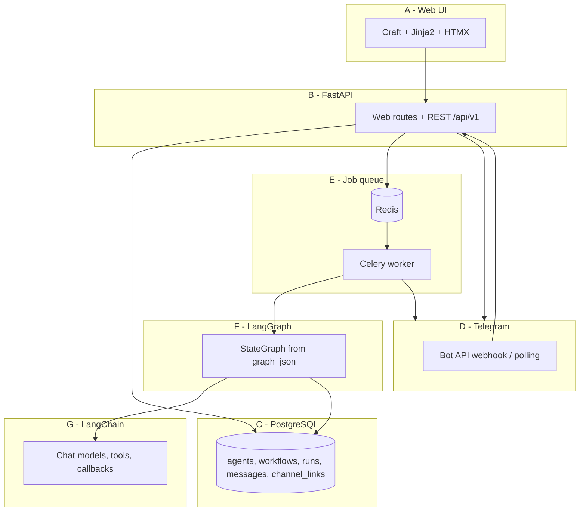

# Architecture - Yuno Agent Orchestration Platform

## Problem and solution

Teams need to orchestrate multiple LLM agents in repeatable workflows, observe runs in real time, and talk to agents over familiar channels. This platform stores agents and workflow graphs in PostgreSQL, executes them with **LangGraph** via a **Celery** worker, exposes a **Craft + HTMX** web UI, and bridges humans through **Telegram**.

## Component diagram (A-G)

## Request flows

### Run workflow (UI)

1. User clicks **Run workflow** -> `POST /workflows/{id}/run`
2. API creates `workflow_runs` row (`pending`), enqueues `execute_workflow_run`
3. Worker marks `running`, builds LangGraph from `graph_json`, runs agents/tools
4. Worker writes `run_messages`, `run_logs`, `run_usage`, marks `completed` or `failed`
5. User watches `/runs/{id}` - HTMX polls fragments every 2s until done

### Telegram chat

1. Human messages bot -> webhook `POST /webhooks/telegram` or long-polling
2. Celery task `process_telegram_update` resolves `channel_links` by `chat_id`
3. `AgentChatService` runs one LLM turn (mock or OpenAI), persists messages on a conversation run
4. Outbound reply via `TelegramChannel.send_message`

## Data model (summary)

| Table | Role |
|-------|------|
| `agents` | Prompt, model, tools, config (memory/schedule/guardrails) |
| `workflows` | `graph_json`, templates flag |
| `workflow_agents` | Maps graph node id -> agent |
| `workflow_runs` | Status, timestamps, error |
| `run_messages` | Inter-agent and channel messages |
| `run_logs` | Structured execution logs |
| `run_usage` | Token/cost per agent step |
| `channel_links` | Agent ↔ Telegram chat id |

## Why LangGraph + LangChain

- **LangGraph** models workflows as a `StateGraph`: agent nodes, condition branches (e.g. triage confidence loop), and channel nodes. State carries `node_outputs`, `loop_counts`, and routing hints - a better fit than a single chain for multi-agent + loops.
- **LangChain** supplies chat models, tool binding (`web_search`, `write_file`, `send_notification`), and callbacks that feed token usage into `run_usage`.

## Why Telegram

- Ubiquitous for demos and async human-in-the-loop
- Simple Bot API (webhook or polling for local dev)
- Simple Bot API without OAuth complexity of Slack/WhatsApp for a first external channel

## Extension points

| Add | Where |
|-----|--------|
| New channel (Slack, WhatsApp) | `app/channels/` adapter + `channel_links.channel_type` |
| New workflow template | `WorkflowService._*_template()` + seed |
| New tool | `app/runtime/tools.py` + agent `tools` json |
| New node type | `graph_builder.py` + builder UI JS |
