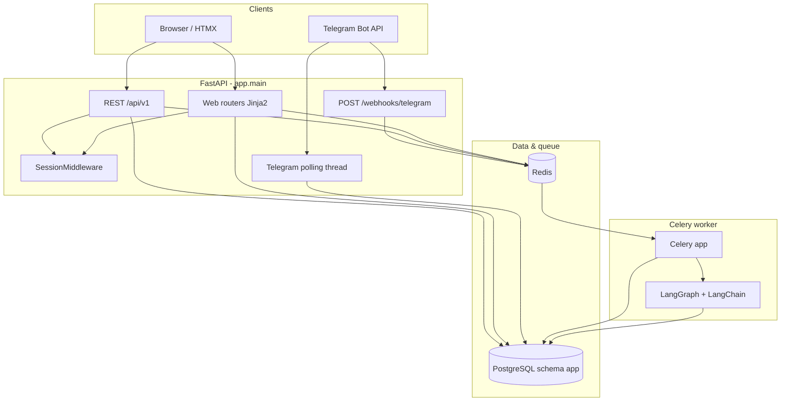
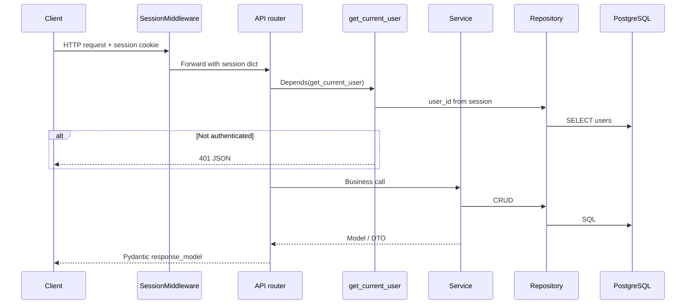
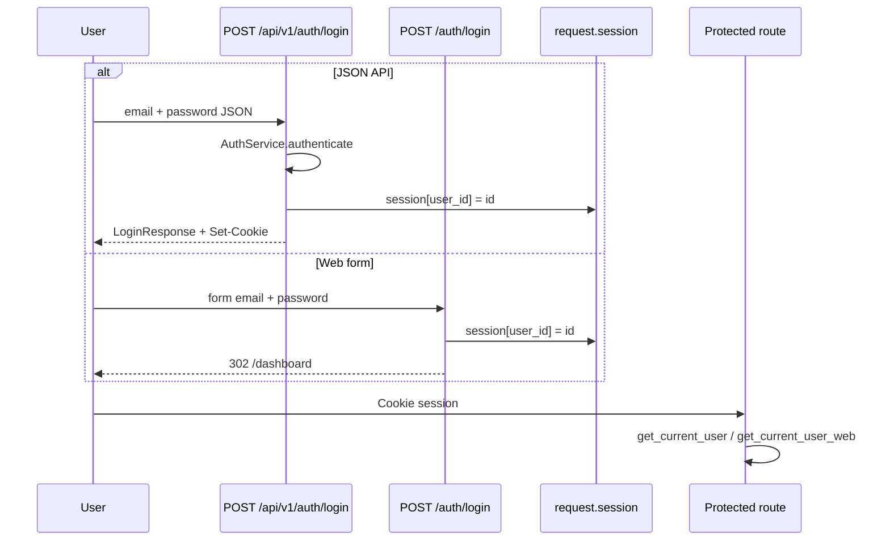
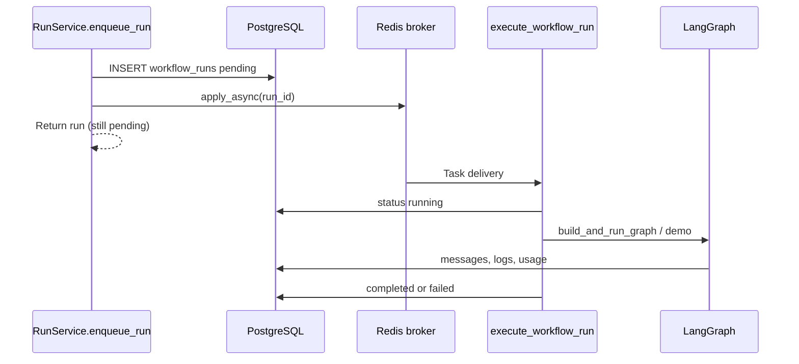

# Architecture

## Summary

**Orqestra** is a **modular monolith**: one FastAPI process serves HTML + JSON API, shares code with a **Celery worker** process, and uses **external PostgreSQL** (not bundled in Compose) plus **Redis** for task queuing.

| Layer | Location | Role |
|-------|----------|------|
| HTTP routers | `backend/app/api/v1/`, `api/web/`, `api/webhooks/` | REST, server-rendered UI, Telegram webhook |
| Services | `backend/app/services/` | Business logic, validation orchestration |
| Repositories | `backend/app/repositories/` | SQLAlchemy persistence |
| Models | `backend/app/models/` | ORM entities (`app` schema) |
| Schemas | `backend/app/schemas/` | Pydantic request/response DTOs |
| Runtime | `backend/app/runtime/` | LangGraph graph build + LangChain LLM/tools |
| Workers | `backend/app/workers/` | Celery tasks (`execute_workflow_run`, `process_telegram_update`) |
| Channels | `backend/app/channels/` | Telegram adapter + optional long-polling thread |

There is **no** separate microservice deployment per domain; scaling is typically **horizontal replicas of API** + **multiple Celery workers** + managed Postgres/Redis.

## High-level diagram

## Request lifecycle (REST)

**Web (HTML) routes** use `get_current_user_web`, which raises `LoginRequired` -> global handler returns **302** to `/auth/login` instead of 401 JSON.

## Authentication flow

Authentication is **session-based** (Starlette `SessionMiddleware` + signed cookie `session`).

| Concern | Implementation |
|---------|----------------|
| Password storage | bcrypt via `passlib` (`app/core/security.py`) |
| Session key | `SESSION_USER_ID_KEY = "user_id"` in `app/core/deps.py` |
| API auth dependency | `get_current_user` -> HTTP 401 |
| Web auth dependency | `get_current_user_web` -> redirect |
| OpenAPI public paths | `/api/v1/auth/login`, `/api/v1/auth/logout` only (`app/openapi.py`) |
| Password reset | Token SHA-256 in DB; email via optional SMTP |

**Security notes (from code):**

- `SessionMiddleware(..., https_only=False)` - cookies are not forced secure; set reverse proxy + HTTPS in production.
- **No role-based access control (by design):** all users share a single operator role. Authentication, password hashing (bcrypt), session signing, and optional SMTP-based password reset are fully implemented. RBAC is a deliberate scope decision for this release — adding it requires a `roles` column on `users` and a `require_role` dependency alongside `get_current_user`.
- Default admin is seeded from `ADMIN_*` env vars when `users` table is empty.

## Database interaction flow

- Engine: SQLAlchemy 2.x `create_engine` with `pool_pre_ping=True` (`app/core/database.py`).
- All ORM tables use metadata schema **`app`** (`APP_SCHEMA` in `app/core/schema.py`).
- Per-request sessions via `get_db()` generator dependency; **Celery tasks** open `SessionLocal()` manually and close in `finally`.
- Migrations: Alembic revisions `001`-`006`; `env.py` creates schema before online migrations.

## Background task flow

| Task | Celery name | Trigger |
|------|-------------|---------|
| `execute_workflow_run` | `execute_workflow_run` | API/UI enqueue run |
| `process_telegram_update` | `process_telegram_update` | Webhook or polling |

`CELERY_TASK_ALWAYS_EAGER=true` runs tasks **inline** in the API process (no Redis worker needed).

## External integrations

| Integration | Module | Config |
|-------------|--------|--------|
| PostgreSQL | SQLAlchemy + psycopg2 | `DATABASE_URL` |
| Redis | Celery broker/backend | `REDIS_URL` |
| OpenAI | `langchain-openai` / `llm_factory.py` | `OPENAI_API_KEY`, `RUNTIME_MOCK_LLM` |
| Telegram | `channels/telegram.py`, webhook, polling | `TELEGRAM_*` |
| SMTP | `services/email_service.py` | `SMTP_*` (optional) |

## Dependency injection structure

FastAPI `Depends` wires:

- `get_db()` -> SQLAlchemy `Session`
- `get_user_repository`, `get_agent_repository`, `get_workflow_repository` -> repository instances
- `_auth_service`, `_user_service`, etc. -> service factories on routers
- `get_current_user` / `get_current_user_web` / `get_current_user_optional`

There is no central DI container; conventions are **router-local factory functions** named `_<domain>_service`.

## Middleware behavior

| Middleware | Order | Behavior |
|------------|-------|----------|
| `SessionMiddleware` | Added in `main.py` after app creation | Signed cookie session; `secret_key` from `SESSION_SECRET_KEY`; `max_age` from settings |

No CORS, rate-limit, or request-ID middleware is registered in `main.py`.

## Application startup (`lifespan`)

On API boot (`app/main.py`):

1. `seed_admin_user()` - first user if table empty
2. `seed_default_agents()` - Researcher/Writer if missing
3. `seed_workflow_templates()` - template workflows
4. `seed_demo_workflow()` - demo workflow record
5. `start_telegram_polling()` - daemon thread if `TELEGRAM_USE_POLLING` + token set

On shutdown: `stop_telegram_polling()`.

## Static assets

- `/static` -> `UI_ASSETS_DIR` (Craft theme under `ui/assets`)
- `/static/js` -> `UI_JS_DIR` (`ui/js`, includes workflow builder)

Workflow graph save from the builder uses **`PUT /api/v1/workflows/{id}/graph`** (see `ui/js/workflow-builder.js`).

## OpenAPI customization

`app/openapi.py` filters Swagger to **`/api/v1/*` and `/health`** only; HTML routes are excluded. Session cookie security scheme is injected for protected operations.

## Undocumented / partial surfaces

| Item | Notes |
|------|-------|
| `ChannelLinkCreate` schema | No REST router; channels are **web UI only** |
| `TelegramWebhookUpdate` schema | Webhook accepts raw `dict`, not validated Pydantic model |
| Channel REST API | **Needs Verification** - intentionally web-only per current code |

See [API Reference](../api/README.md) for the full route inventory.
