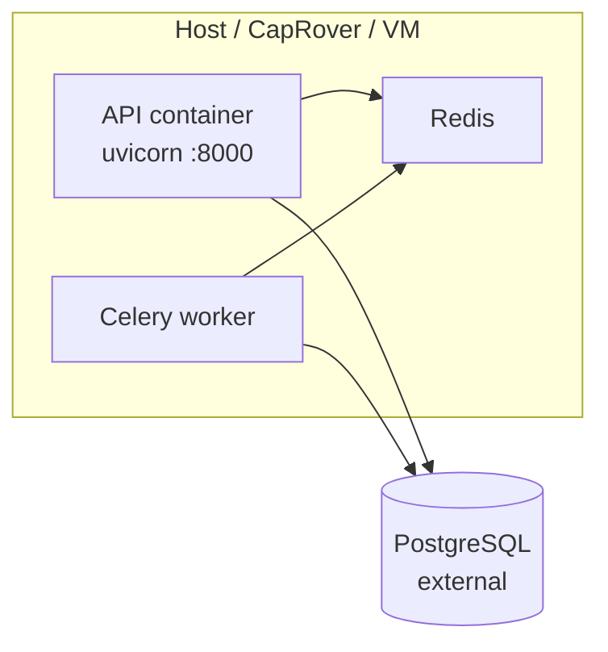

# Deployment

Inferred from `Dockerfile`, `backend/Dockerfile`, `docker-compose.yml`, `captain-definition`. **No Kubernetes manifests or CI/CD configs** were found in the repository.

## Deployment topology



| Component | Image / build | Notes |
|-----------|---------------|-------|
| API | `backend/Dockerfile` or root `Dockerfile` | Runs migrations + uvicorn |
| Worker | Same image, different `command` | Required unless `CELERY_TASK_ALWAYS_EAGER` |
| Redis | `redis:7-alpine` in Compose | Broker + result backend |
| PostgreSQL | **External** | Set `DATABASE_URL` |

## Build process

### Development Compose (`backend/Dockerfile`)

- Context: `./backend`
- Installs `requirements.txt`, copies app code
- Compose command: `alembic upgrade head && uvicorn ... --reload`
- Volume-mounts `backend/` for hot reload

### Production root (`Dockerfile`)

- Copies `backend/` + `ui/assets` + `ui/js`
- Sets `UI_ASSETS_DIR`, `UI_JS_DIR`
- **HEALTHCHECK** on `GET /health`
- CMD: `alembic upgrade head && uvicorn app.main:app --host 0.0.0.0 --port 8000` (no reload)

### CapRover

`captain-definition`:

```json
{
  "schemaVersion": 2,
  "dockerfilePath": "./Dockerfile"
}
```

Build from **repository root**, not `backend/` alone.

**Needs Verification:** `docs/DEPLOY_CAPROVER.md` is referenced in README but **not present** in the repo at documentation time.

## Runtime requirements

| Resource | Minimum guidance |
|----------|------------------|
| CPU | 1+ cores API; worker scales with concurrent runs |
| Memory | LangGraph + LangChain per run; size worker pool accordingly |
| Disk | Stateless containers; persistence in Postgres |
| Network | Outbound HTTPS for OpenAI, Telegram; inbound 8000 (or reverse proxy) |

## Environment & secrets

| Secret | Handling |
|--------|----------|
| `DATABASE_URL` | CapRover/env injection; never commit |
| `SESSION_SECRET_KEY` | Strong random per environment |
| `OPENAI_API_KEY` | Platform secret store |
| `TELEGRAM_BOT_TOKEN` | Platform secret store |
| `TELEGRAM_WEBHOOK_SECRET` | Match Telegram `setWebhook` secret |
| `SMTP_*` | Optional; for password reset only |

Do not commit `.env` (listed in `.gitignore`).

## Scaling considerations

| Dimension | Approach |
|-----------|----------|
| HTTP | Multiple API replicas behind load balancer; sticky sessions **recommended** (session cookie) |
| Workers | Increase Celery worker concurrency / replica count |
| Redis | Single instance in Compose; use managed Redis in prod |
| Postgres | Connection pool default SQLAlchemy; tune `pool_size` **Needs Verification** (not set in code) |
| Long requests | Run enqueue returns 202 immediately; heavy work in worker |

**Telegram polling:** Runs in **API process** daemon thread (`telegram_polling.py`). Multiple API replicas with polling enabled could duplicate update handling - prefer **webhook mode** with one webhook endpoint or a single polling instance.

## Production risks

| Risk | Mitigation |
|------|------------|
| Default admin seed | Change password; restrict network on first deploy |
| Session cookie not HTTPS-only | Terminate TLS at proxy; consider `https_only=True` code change |
| Open webhook without secret | Set `TELEGRAM_WEBHOOK_SECRET` |
| Migrations on boot | Root Dockerfile runs `alembic upgrade head` on every start - ensure single-writer or job-based migrate for large fleets |
| No Celery retry | `max_retries=0` on tasks - failed runs stay `failed` |
| External Postgres dependency | Monitor connectivity; `pool_pre_ping=True` helps |
| `DEBUG=true` | Set `DEBUG=false` in production |

## Docker Compose (reference)

```bash
docker compose up --build -d
```

Services: `redis`, `api`, `worker`. Port publish: `3000:8000`.

## Health checks

| Endpoint | Use |
|----------|-----|
| `GET /health` | LB / Docker HEALTHCHECK / CapRover |

Response: `{"status":"ok","app":"Orqestra"}`.

**Needs Verification:** Readiness probe that checks Postgres/Redis is **not implemented** in code.

## Worker deployment

Same image as API:

```bash
celery -A app.workers.celery_app worker --loglevel=info
```

Ensure `REDIS_URL` matches API and `DATABASE_URL` is reachable from worker network (Compose uses `host.docker.internal` for VM Postgres).

## Static files

Production image embeds UI assets at `/ui-assets` and `/ui-js`. No separate CDN step in repo.
